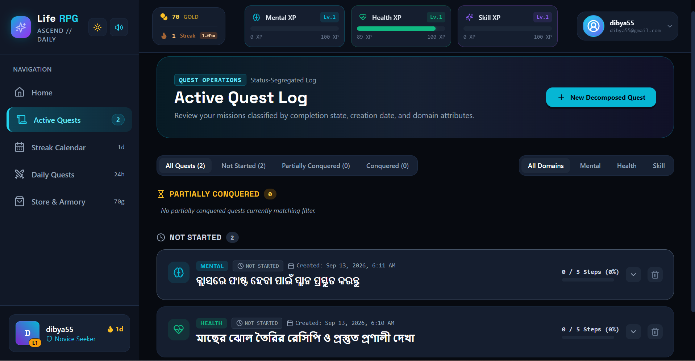
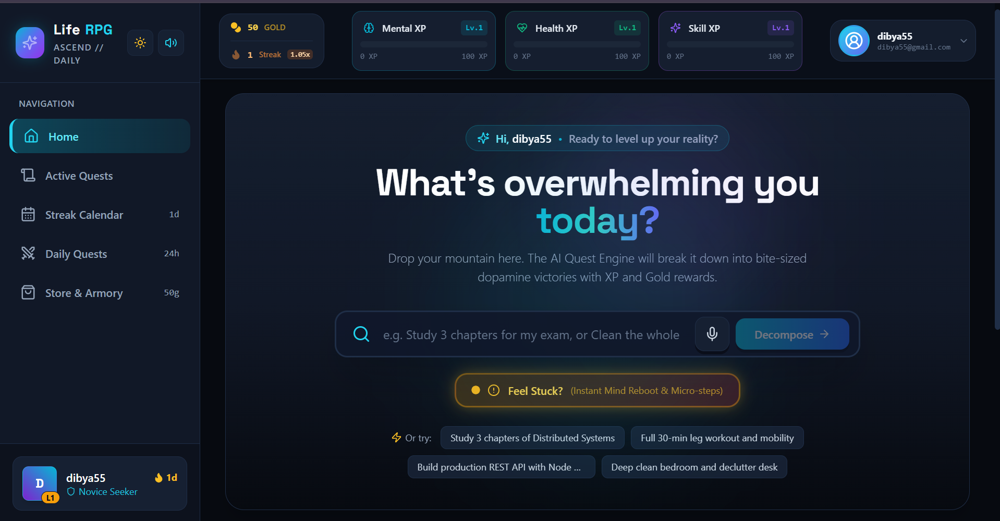
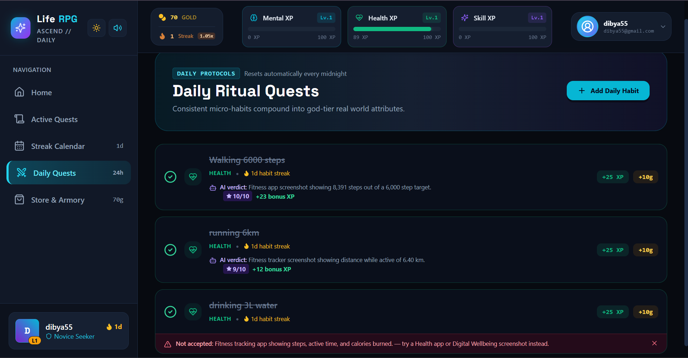
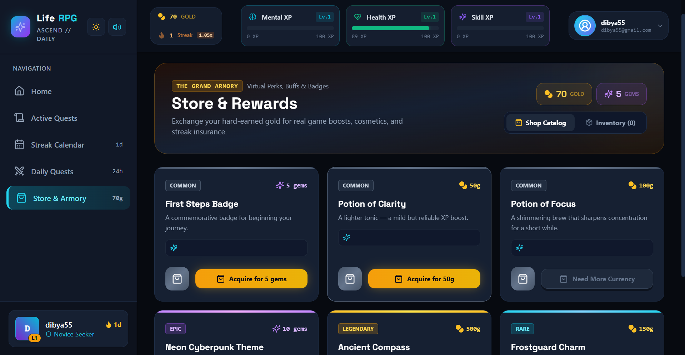
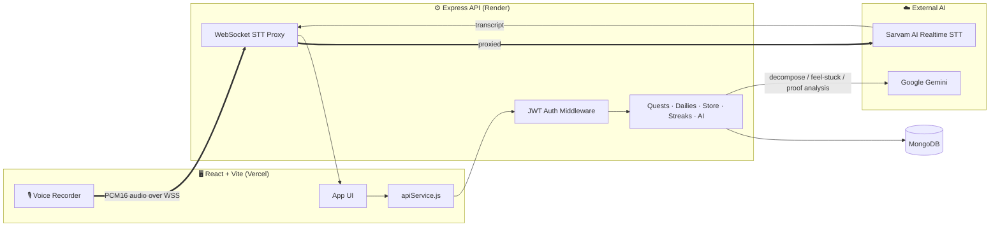

<div align="center">

# ⚔️ Life RPG
### Turn your to-do list into a quest log.

**Real tasks. Real habits. Real XP.** An AI-powered gamification engine that breaks overwhelming goals into tiny dopamine-friendly steps — with voice input, streaks, a loot store, and photo proof-of-completion.

[](https://react.dev)
[](https://vitejs.dev)
[](https://tailwindcss.com)
[](https://expressjs.com)
[](https://www.mongodb.com)
[](https://ai.google.dev)
[](https://sarvam.ai)
[](https://render.com)
[](https://vercel.com)
[](#-license)

[**Live App**](https://life-rpg-three-psi.vercel.app/) · [Report a Bug](https://github.com/abhisek0407/LIFE_RPG/issues) · [Request a Feature](https://github.com/abhisek0407/LIFE_RPG/issues)

</div>

---

## 🧭 Table of Contents

- [Why Life RPG](#-why-life-rpg)
- [Screenshots](#-screenshots)
- [Features](#-features)
- [Tech Stack](#-tech-stack)
- [Architecture](#-architecture)
- [Getting Started](#-getting-started)
- [Environment Variables](#-environment-variables)
- [Core Gamification Rules](#-core-gamification-rules)
- [API Reference](#-api-reference)
- [Deployment](#-deployment)
- [Roadmap](#-roadmap)

---

## 💡 Why Life RPG

Traditional productivity apps feel like chores because the real-world payoff of going to the gym, finishing a degree, or cleaning an apartment takes weeks to materialize. Your brain doesn't wait that long for a reward signal — so it gives up first.

**Life RPG closes that gap.** Every real action — no matter how small — pays out immediately: XP ticks up, gold drops, a streak flame grows, and your character levels up in front of you. The overwhelming task never has to feel finished to feel *rewarded*.

- 🎉 **Immediate Dopamine** — confetti, 8-bit procedural sound chimes, and floating XP/gold numbers on every single micro-action.
- 🧩 **Micro-Steps Beat Paralysis** — an AI Quest Engine decomposes any goal into 4–6 concrete steps, tuned to your stated motivation level (Low / Medium / High).
- 🧘 **"Feel Stuck" Emergency Chamber** — one tap gives you box-breathing (4-4-4-4) plus 3 tiny grounding actions to unfreeze executive dysfunction.
- 🗣️ **Talk instead of type** — speak your task out loud in *any language* and the AI titles, categorizes, and decomposes it for you.

---

## 📸 Screenshots

| | |
|:---:|:---:|
| **Active Quest Log** | **Home — Decompose a Goal** |
|  |  |
| **Daily Ritual Quests** | **Store & Armory** |
|  |  |

---

## ✨ Features

### 🎯 AI Quest Decomposition
Describe a task, pick a domain and difficulty, and Gemini breaks it into concrete microtasks with individually-tuned XP/Gold rewards. If the AI is unreachable, a deterministic rule-based engine kicks in automatically — the app never blocks on AI availability.

### 🎙️ Realtime Multilingual Voice Input
Tap the mic and just talk. Audio streams live over WebSockets to **Sarvam AI's** realtime speech-to-text (auto language detection — Hindi, Odia, English, and more), and the transcript is handed straight to Gemini, which infers the task title, domain, *and* generates the microtask breakdown in a single round trip. Your API keys never touch the browser — everything is proxied through the authenticated backend.

### 📆 Daily Ritual Quests + Photo Proof
Recurring daily habits with their own streak counters. Attach a photo when you complete one (workout screenshot, a photo of your desk, whatever proves it) — the image is analyzed once for a short description shown in your reward toast, then **immediately discarded**. It's never written to disk or stored in the database; only the description text is logged.

### 🔥 Streaks & Activity Heatmap
A 30-day activity heatmap (built from an aggregated audit log) plus a streak multiplier that adds +5% bonus XP per consecutive active day, up to +50% at 10 days. Streak Freeze items protect your flame if life gets in the way.

### 🏪 Store & Inventory
Spend gold on XP potions, streak freezes, cosmetic titles, and themes. Full inventory system backed by MongoDB.

### 🧘 "I Feel Stuck" Grounding Mode
A dedicated support flow: an AI-generated (or fallback static) breathing exercise plus 3 sub-2-minute grounding microtasks, for the moments a task feels too big to start.

### 📊 Non-Linear Character Progression
Three independent domains — **Mental**, **Health**, and **Skill/Personality** — each leveling on a non-linear curve, so growth always feels earned:

$$\text{XP required for Level } L = \lfloor 100 \times L^{1.5} \rfloor$$

### 🛡️ Server-Authoritative Everything
XP, gold, and levels are computed and persisted entirely server-side via JWT-authenticated endpoints — the client can't spoof rewards. A comprehensive `ActivityLog` audit trail backs every completion, purchase, and level-up.

---

## 🛠️ Tech Stack

| Layer | Technology |
|---|---|
| **Frontend** | React 18 · Vite · Tailwind CSS · Lucide Icons · canvas-confetti |
| **Backend** | Node.js · Express 5 · Mongoose (MongoDB) · JWT Auth · WebSockets (`ws`) |
| **AI Engine** | Google Gemini (task decomposition, voice-to-quest, feel-stuck guide, proof-image analysis) |
| **Voice** | Sarvam AI realtime STT, proxied over an authenticated WebSocket |
| **Deployment** | Render (backend) · Vercel (frontend) |

---

## 🏗️ Architecture



A local-storage fallback layer (`storageService.js`) lets the frontend keep working in an offline/demo mode if the backend is ever unreachable, mirroring the same reward math client-side.

---

## 🚀 Getting Started

### Prerequisites
- Node.js v18+
- npm v9+
- A MongoDB connection string (local or [MongoDB Atlas](https://www.mongodb.com/atlas))
- A [Google Gemini API key](https://ai.google.dev)
- *(Optional, for voice input)* a [Sarvam AI](https://sarvam.ai) API key

### 1. Clone the repository
```bash
git clone https://github.com/abhisek0407/LIFE_RPG.git
cd LIFE_RPG
```

### 2. Backend setup
```bash
cd backend
npm install
cp .env.example .env   # then fill in your real values — see table below
npm run dev             # starts on http://localhost:5000
```

### 3. Frontend setup
```bash
cd frontend
npm install
npm run dev              # starts on http://localhost:5173 (or :3000, per Vite config)
```

### 4. Build for production
```bash
cd frontend && npm run build
```

---

## 🔐 Environment Variables

### `backend/.env`

| Variable | Required | Description |
|---|:---:|---|
| `MONGODB_URI` | ✅ | MongoDB connection string |
| `JWT_SECRET` | ✅ | Long random string used to sign auth tokens — generate your own, never reuse an example value |
| `PORT` | – | Defaults to `5000` (Render sets this automatically in production) |
| `GEMINI_API_KEY` | ✅ | Powers task decomposition, voice-to-quest, feel-stuck guidance, and proof-photo analysis |
| `GEMINI_MODEL` | – | Defaults to `gemini-2.0-flash` |
| `CORS_ORIGIN` | – | Comma-separated list of extra allowed frontend origins, on top of the ones hardcoded in `server.js` |
| `SARVAM_API_KEY` | – | Enables realtime voice input; the app degrades gracefully without it |
| `SARVAM_STT_WS_URL` / `SARVAM_STT_LANGUAGE_CODE` / `SARVAM_STT_MODEL` / `SARVAM_STT_SAMPLE_RATE` | – | Sarvam STT tuning, sensible defaults provided |

### `frontend/.env`

| Variable | Required | Description |
|---|:---:|---|
| `VITE_API_BASE_URL` | ✅ | Your backend's base URL, e.g. `https://your-service.onrender.com/api` |
| `VITE_ENABLE_SOUND` | – | `true`/`false` — toggles the procedural sound engine |

---

## 🏆 Core Gamification Rules

| Difficulty | Base XP | Base Gold | Microtask Spread |
|---|---|---|---|
| **Easy** | 50 XP | 15 Gold | 3–4 steps |
| **Medium** | 120 XP | 35 Gold | 4–5 steps |
| **Hard** | 300 XP | 80 Gold | 5–6 steps |

- **Streak bonus:** +5% XP per consecutive active day, capped at +50% (1.5×) at 10 days.
- **Phoenix Feather:** a store item that protects your streak if you miss a day.
- **Non-linear leveling:** `XP(L) = ⌊100 × L^1.5⌋` — each level demands meaningfully more than the last.

---

## 📡 API Reference

Full request/response contracts and Mongoose schemas live in [`api_contracts_and_schema.json`](./api_contracts_and_schema.json) — the single source of truth kept in sync between frontend and backend.

| Domain | Base Path |
|---|---|
| Auth | `/api/auth` |
| Quests & Microtasks | `/api/quests` |
| Daily Rituals | `/api/daily-quests` |
| Store & Inventory | `/api/store` |
| Streaks & Heatmap | `/api/streaks` |
| AI (decompose / voice / feel-stuck) | `/api/ai` |
| Voice STT | `wss://<host>/ws/stt?token=<jwt>` |

---

## ☁️ Deployment

This project runs as two independently deployed services:

- **Backend → [Render](https://render.com)** — Node web service, root directory `backend`, build `npm install`, start `npm start`. Set all backend env vars above in Render's dashboard.
- **Frontend → [Vercel](https://vercel.com)** — set `VITE_API_BASE_URL` to your Render backend URL and redeploy.

> ⚠️ Whenever you deploy the frontend to a new domain, add that exact origin to `allowedOrigins` in `backend/server.js` (or via the `CORS_ORIGIN` env var) — otherwise the API will reject its requests.

---

## 🗺️ Roadmap

- [ ] Social / friend leaderboards
- [ ] Native mobile wrapper
- [ ] Configurable habit reminders / push notifications
- [ ] Optional native health-app integrations (Google Fit / Apple Health) as an alternative to manual proof photos

---

<div align="center">

**Built to make real life feel a little more like a game worth playing.**

</div>